# PENETRATION TESTING REPORT

**Footprinting & Reconnaissance Phase**

*W2 \| Cybersecurity \| NetworkWalks Academy*

| **Pentester Name (Cybersecurity Student)** | Noman Atiq |
|---|---|
| **Program/Batch** | B083 - NetworkWalks Academy |
| **Date** | 18-19 September 2026 |
| **Modules completed** | W2-PM1 (Multi-tool Footprinting) W2-PM2 (GHDB) W2-PM3 (Maltego) W2-PM4 (theHarvester) W2-PM5 (Zenmap Scanning) |
| **Client/Target** | 1. networkwalks.com (educational target used throughout the course) 2. microsoft.com (theHarvester exercise target) 3. My own local LAN network (Zenmap) |
| **Permission secured from client?** | Yes - educational lab scope as defined by NetworkWalks Academy |
| **Phases covered** | Phase 1: Reconnaissance & Footprinting (complete) Phase 2: Scanning & Network Discovery (complete) |

## 1. Liability Disclaimer

I performed these activities only on the systems and targets covered by the NetworkWalks Academy lab scope, and on my own local network. All materials and activities are for education and research purposes only. I did not use anything here to break the law. Every action I took is my own responsibility, and I understand that unauthorised access is a crime in most countries even when nothing is damaged.

## 2. Introduction

This report covers the footprinting and reconnaissance phase of Week 2 of my NetworkWalks Academy cybersecurity internship. It brings together four completed modules - multi-tool footprinting against networkwalks.com (W2-PM1), Google Hacking Database dorking (W2-PM2), OSINT graphing with Maltego (W2-PM3), and email/sub-domain harvesting with theHarvester against microsoft.com (W2-PM4) - plus the network scanning module with Zenmap (W2-PM5).

Together these modules show how an attacker moves from passive, publicly-available information gathering (WHOIS, DNS, Google dorking, OSINT graphing) toward active discovery of live hosts on a network. Every step below includes the exact command or tool used, the result I observed, and a short note on why the finding matters from an attacker's point of view.

Work for this week was originally started on a VirtualBox Kali Linux VM. Partway through, that VM developed a recurring disk I/O / CRC error (VERR_IO_CRC) that snapshot restores could not resolve. I moved the remaining work to a fresh Kali Linux VM in VMware Workstation to keep the lab moving, and redid the affected tasks there. This is noted here as part of the honest working record of the week, and is discussed further in the Recommendations section.

## 3. Tools Used

| **Tool** | **Purpose** |
|---|---|
| Kali Linux (VMware) & Browser | Environment used for reconnaissance, dorking, Maltego and theHarvester |
| whois | Find domain registration details (owner, dates, name servers) |
| whatweb | Fingerprint web technologies (server, CMS, plugins, IP) |
| nslookup | Resolve the domain name to its IP address using DNS |
| curl -I | Read the HTTP response headers of the website |
| wafw00f | Detect whether a Web Application Firewall protects the site |
| dnsrecon | Enumerate DNS records (NS, MX, SPF, TXT, SRV) |
| GHDB (exploit-db.com) | Find sensitive info exposed to Google via dorks (cameras, open directories) |
| Maltego CE | Graph-based OSINT tool; harvested email addresses linked to the domain |
| theHarvester | Gather emails and sub-domains for a target from public sources |
| Zenmap (Nmap GUI) | Scan the local subnet to find live hosts, IPs and MAC addresses |

## 4. Activities Performed

### 4.1 W2-PM1: Footprinting with Multiple Kali Tools

I footprinted the live website networkwalks.com using six built-in Kali Linux tools: whois, whatweb, nslookup, curl, wafw00f and dnsrecon.

**whois networkwalks.com** - returned the domain's registrar (GoDaddy), creation date (2019), expiry date (2027), and name servers pointing to HostGator, revealing the hosting provider.

**whatweb networkwalks.com** - fingerprinted the site as running WordPress 7.1.1 with the WP Download Manager 3.3.58 plugin, and exposed the server IP and a contact email.

**nslookup networkwalks.com** - resolved the domain to 192.232.216.135.

**curl -I https://networkwalks.com** - returned HTTP response headers and revealed the WordPress REST API endpoint (/wp-json/).

**wafw00f networkwalks.com** - identified that the site sits behind ModSecurity (SpiderLabs) as its Web Application Firewall.

**dnsrecon -d networkwalks.com** - enumerated the domain's NS, MX, SPF/TXT and SRV records, and identified the authoritative DNS server software version.

This module was completed twice: once on the original VirtualBox VM, and again in full on the replacement VMware VM after the disk error, to keep the evidence consistent with the environment I ultimately used for the rest of the week.

### 4.2 W2-PM2: Footprinting with GHDB (Google Hacking Database)

For this module I used exploit-db.com's Google Hacking Database to find sensitive information exposed to Google search, without ever directly touching the target devices.

#### Task 1: 10 live, exposed security camera links

I searched GHDB for camera-related dorks (e.g. intitle:"Webcam" inurl:WebCam.htm and intitle:"Camera Live Image" inurl:"guestimage.html"), ran them in Google, and manually verified each result was a genuinely live, unauthenticated camera feed before logging it.

| **No.** | **Link** | **Relevant Dork** | **Username/Password** |
|---|---|---|---|
| 1 | [http://99.114.240.169:8080](http://99.114.240.169:8080/) | intitle:"Webcam" inurl:WebCam.htm | --- |
| 2 | <https://www.lmc.edu/webcam.htm> | intitle:"Webcam" inurl:WebCam.htm | --- |
| 3 | <https://pv.viewsurf.com/?id=404&i=NjkwNDp1bmRlZmluZWQ> | intitle:"Webcam" inurl:WebCam.htm | --- |
| 4 | <http://109.164.203.165/cgi-bin/guestimage.html> | intitle:"Camera Live Image" inurl:"guestimage.html" | --- |
| 5 | <http://125.236.232.93:9015/cgi-bin/guestimage.html> | intitle:"Camera Live Image" inurl:"guestimage.html" | --- |
| 6 | <http://125.236.232.93:9007/cgi-bin/guestimage.html> | intitle:"Camera Live Image" inurl:"guestimage.html" | --- |
| 7 | <http://173.69.185.179:9001/cgi-bin/guestimage.html> | intitle:"Camera Live Image" inurl:"guestimage.html" | --- |
| 8 | <http://125.236.232.93:9008/cgi-bin/guestimage.html> | intitle:"Camera Live Image" inurl:"guestimage.html" | --- |
| 9 | <http://125.236.232.93:9012/cgi-bin/guestimage.html> | intitle:"Camera Live Image" inurl:"guestimage.html" | --- |
| 10 | <http://125.236.232.93:9013/cgi-bin/guestimage.html> | intitle:"Camera Live Image" inurl:"guestimage.html" | --- |

One entry (No. 6) showed a static image with a running timestamp but no visible motion - still logged as live since the server was actively responding, just possibly a stuck or slow-refresh camera. I left the screenshots of the camera feeds out of this public copy because they show people and private property; the links above can be used to cross-check each entry.

#### Task 2: 10 listings with downloadable mathematics PDFs

Using the dork intitle:index.of "parent directory" mathematics pdf (and minor variations), I found 10 public directory listings containing downloadable mathematics ebooks in PDF format.

| **No.** | **Link**                                                           | **Relevant Dork**                                   | **Username/Password** |
|---------|--------------------------------------------------------------------|-----------------------------------------------------|-----------------------|
| 1       | <http://erewhon.superkuh.com/library/Math/>                        | intitle:index.of "parent directory" mathematics pdf | ---                   |
| 2       | <https://www.unm.edu/~megrad/Math/>                                | intitle:index.of "parent directory" mathematics pdf | ---                   |
| 3       | <https://education.giakonda.org.uk/Maths/>                         | intitle:index.of "parent directory" mathematics pdf | ---                   |
| 4       | <https://www.wvfa.org/pdf/projectLearningTree/>                    | intitle:index.of "parent directory" mathematics pdf | ---                   |
| 5       | <https://www.easyteacherworksheets.com/pages/pdf/math/>            | intitle:index.of "parent directory" mathematics pdf | ---                   |
| 6       | <https://www.netlib.org/math/docpdf/>                              | intitle:index.of "parent directory" mathematics pdf | ---                   |
| 7       | <https://www.ellerman.org/Davids-Stuff/Maths/>                     | intitle:index.of "parent directory" mathematics pdf | ---                   |
| 8       | <https://ochicken.net/library/Mathematics/>                        | intitle:index.of "parent directory" mathematics pdf | ---                   |
| 9       | <https://lira.epac.to/DOCS-TECH/Math/Engineering%20and%20Applied/> | intitle:index.of "parent directory" mathematics pdf | ---                   |
| 10      | <http://inis.jinr.ru/sl/vol2/Mathematics/Math.Encyclopedia/Pdf/>   | intitle:index.of "parent directory" mathematics pdf | ---                   |

### 4.3 W2-PM3: Footprinting with Maltego

I installed Maltego Community Edition on the Kali VM and created a free Maltego ID account. I dragged a Domain entity onto the graph, set it to networkwalks.com, and ran email-harvesting transforms against it (To Email Addresses \[Search Engine\] and related transforms).

The resulting graph identified two email addresses linked to the target domain:

- <info@networkwalks.com> - the domain's own contact address

- <abuse@godaddy.com> - the registrar's abuse-reporting contact, surfaced via WHOIS-derived data

This shows how a small amount of OSINT tooling can quickly build a visual picture of an organization's public-facing contact points.

### 4.4 W2-PM4: Footprinting with theHarvester

theHarvester comes pre-installed on Kali Linux. I ran it against microsoft.com as instructed by the lab, since it is a much larger and more well-known domain than networkwalks.com, giving a better sense of the tool's scale.

#### Task 1 - theHarvester -d microsoft.com -l 1000 -b baidu

Baidu is a single search-engine source, and its results proved highly variable between runs (a known limitation, since it depends on Baidu's own live index). My saved evidence run returned no IPs, emails, people or hosts for that particular query - a valid, if unremarkable, result. An earlier informal run against the same target had returned a handful of sub-domains and one email, illustrating just how much external, live sources can differ run to run.

#### Task 2 - theHarvester -d microsoft.com -l 50 -b all

Running with all available sources (most requiring no API key) returned a very large result set:

- 131 IP addresses identified, largely Microsoft's own Azure/CDN infrastructure ranges

- 9,901 hosts/sub-domains identified (e.g. learn.microsoft.com, azure.microsoft.com, copilot.microsoft.com, and thousands of internal/dev/test hostnames)

- 7 ASNs identified (Microsoft's own autonomous system numbers, e.g. AS8075, AS8070)

- 4 "interesting URLs" including live OAuth authorization endpoints

- 0 emails and 0 LinkedIn users - most paid-API sources (Shodan, VirusTotal, Hunter, SecurityScorecard, etc.) were skipped due to missing API keys, but the free sources still returned a substantial dataset

This result demonstrates that even without paid OSINT subscriptions, passive sub-domain enumeration alone can reveal an enormous attack surface for a large organization.

### 4.5 W2-PM5: Network Scanning with Zenmap

For this module I installed Zenmap in VMware Workstation and identified my VM's NAT subnet as 192.168.199.0/24 (VMware's VMnet8 network), replacing the 10.0.0.0/24 subnet used in the instructor's example.

I ran the scan from my Kali VM using Zenmap's Intense scan profile, which runs nmap -T4 -A -v 192.168.199.0/24. It covered all 256 addresses in the subnet and finished in about 138 seconds.

**Task 4 - How many hosts are live?** Four hosts responded.

**Task 5 - Their IP addresses:** 192.168.199.1, 192.168.199.2, 192.168.199.129 and 192.168.199.254.

**Task 6 - Their MAC addresses:** 192.168.199.1 was 00:50:56:C0:00:08, 192.168.199.2 was 00:50:56:E9:20:8F and 192.168.199.254 was 00:50:56:E3:23:6E. Nmap does not report a MAC for the machine it is running on, so I got my Kali VM's MAC (192.168.199.129) from ip a instead. It starts with the VMware prefix 00:0c:29, and I have hidden the last three octets in the screenshot and here because this report is public.

Looking at each host: 192.168.199.1 is my Windows host on the VMnet8 adapter, with port 903 (VMware Authentication Daemon) and port 5357 (Microsoft HTTPAPI/WSDAPI) open. 192.168.199.2 is VMware's NAT and DNS device, with port 53 open running dnsmasq 2.51. 192.168.199.254 and my own Kali VM (192.168.199.129) showed every port as filtered, so I could not identify any service on them; 192.168.199.254 is where VMware's DHCP service normally sits. The MAC prefixes (00:50:56 and 00:0c:29) both belong to VMware, so these are all virtual devices rather than separate physical machines. The Zenmap topology view shows my Kali VM in the centre with the other three hosts one hop away.

## 5. Risk Analysis / Impact

Based on the information collected across these modules, I identified the following potential risks.

| **#** | **Risk / Finding** | **Evidence / Observation** | **Potential Impact** | **Risk Level** |
|---|---|---|---|---|
| 1 | Web technology exposed | WhatWeb identified WordPress and WP Download Manager version info | Attackers may look up known exploits for the identified versions | Medium |
| 2 | Server IP identifiable | Nslookup resolved the live IP of networkwalks.com | Reveals hosting location and enables direct scanning of the server | Low |
| 3 | HTTP technical info exposed | Curl -I returned response headers and the /wp-json/ REST API endpoint | Assists fingerprinting and further enumeration | Low |
| 4 | WAF identifiable | Wafw00f identified ModSecurity (SpiderLabs) | Reveals the site's security architecture | Low |
| 5 | DNS infrastructure exposed | DNSRecon enumerated NS/MX/SPF/TXT/SRV records and DNS server version | Helps build a broader infrastructure profile of the target | Medium |
| 6 | Live cameras exposed publicly | 10 unauthenticated live camera feeds found via GHDB dorks | Feeds can be viewed by anyone; some allow pan/tilt/zoom control | Critical |
| 7 | Open directory listings exposed | 10 public directories with downloadable PDFs found via GHDB | Shows organizations often leave server directory browsing enabled | Low |
| 8 | Domain-linked emails harvested | Maltego and theHarvester surfaced [info@networkwalks.com](mailto:info@networkwalks.com) and related contact/registrar emails | Usable for phishing or social-engineering a target organization | Medium |
| 9 | Large subdomain footprint | theHarvester (all sources) returned 9,901 hosts and 131 IPs for microsoft.com | A larger attack surface; forgotten/legacy subdomains may be more vulnerable | Medium |
| 10 | Live LAN hosts and exposed services | Zenmap Intense scan of 192.168.199.0/24 found 4 live hosts; ports 903 and 5357 open on the host adapter and dnsmasq 2.51 on the NAT gateway | Unknown/unauthorized devices could be present, and exposed services can be fingerprinted for known weaknesses | Medium |

> *Risk level key: Critical / Medium / Low*

These are observations from information-gathering and enumeration exercises, not confirmed vulnerabilities. No exploitation or unauthorized access was attempted against any live camera, host, or system beyond viewing what was already exposed publicly. Further authorized testing would be required to confirm whether any of these observations represent an exploitable weakness.

## 6. Recommendations

1.  Review publicly exposed technology information - organizations should regularly audit what WhatWeb-style fingerprinting reveals about their CMS, plugins and server software.

2.  Keep software updated - CMS platforms and plugins (e.g. WordPress, WP Download Manager) should be patched and reviewed against current advisories.

3.  Review HTTP headers and hidden endpoints - unnecessary technical detail (like exposed REST API paths) should be minimised.

4.  Audit DNS records periodically - only required NS/MX/TXT/SRV records should remain publicly resolvable.

5.  Keep the WAF properly configured and monitored - ModSecurity is already in place for networkwalks.com and should stay tuned against evolving threats.

6.  Never expose device admin/viewing interfaces (e.g. IP cameras) without authentication - the ten live camera feeds found via simple Google dorks show how common and easy this exposure is.

7.  Disable directory listing on public web servers unless specifically required - open "index of" listings unintentionally expose entire file trees.

8.  Limit what OSINT tools like Maltego and theHarvester can find - minimise publicly listed contact emails and monitor for newly indexed sub-domains, especially forgotten dev/test/staging hosts.

9.  Perform regular internal network discovery - periodic Zenmap-style scans help catch unknown or unauthorized devices on a LAN.

10. Maintain a rollback plan for lab/VM environments - the VirtualBox disk corruption encountered this week is a reminder to snapshot frequently and keep coursework isolated in its own VM.

11. Always perform reconnaissance and scanning only within an authorized scope, as was done throughout this exercise.

## 7. Conclusion

During Week 2 of my Cybersecurity & Ethical Hacking internship at NetworkWalks Academy, I completed four full footprinting/reconnaissance modules and a fifth network-scanning module.

Across whois, whatweb, nslookup, curl, wafw00f and dnsrecon (W2-PM1), I learned how six simple, unauthenticated Kali tools together build a surprisingly complete profile of a target - its registrar, hosting provider, IP address, technology stack, firewall, and DNS infrastructure.

Google Hacking Database dorking (W2-PM2) showed me how ordinary Google search, aimed with the right operators, can surface exposed devices and open file listings that organizations never meant to publish - without the target ever being directly contacted.

Maltego (W2-PM3) and theHarvester (W2-PM4) demonstrated graph-based and command-line approaches to the same OSINT goal: harvesting emails and sub-domains from public sources. Running theHarvester against microsoft.com in particular showed how even free, no-API-key sources can return thousands of sub-domains for a large organization.

Zenmap (W2-PM5) showed me how much a single scan reveals even on a tiny lab network: live hosts, open ports, service versions and rough OS guesses. It also showed me that Nmap cannot report the MAC address of the machine it is running on, so I had to read mine from ip a.

I also learned a practical lesson outside the lab tasks themselves: my original VirtualBox Kali VM developed a disk-level I/O/CRC error partway through the week that snapshot restores could not fix, so I rebuilt my environment in VMware Workstation and re-ran the affected module. This reinforced how important frequent snapshots and a documented recovery process are when working in virtualized lab environments.

Overall, this week reinforced that reconnaissance is a quiet, largely passive phase, but one that can expose a great deal about a target before any active exploitation is even considered - and that reconnaissance and scanning must always stay within an authorized, educational scope.

## 8. Evidence Collected

The following evidence was captured and saved during this week's modules (screenshots and raw tool output saved to the Week 2 evidence folder on the Kali VM):

- W2-PM1: terminal screenshots + text output for whois, whatweb, nslookup, curl -I, wafw00f, dnsrecon

- W2-PM2: GHDB dork-list screenshots + browser screenshots of the directory listings (camera feed screenshots left out of this public copy for privacy)

- W2-PM3: Maltego graph screenshot showing the networkwalks.com domain entity and harvested email addresses

- W2-PM4: terminal screenshots + text output (theharvester_task2.txt) for both Baidu and all-sources runs against microsoft.com

- W2-PM5: Zenmap Intense scan output, screenshot of the Topology tab, host/IP/MAC list, and an ip a screenshot from the Kali VM with the last three MAC octets hidden

### W2-PM1 screenshots
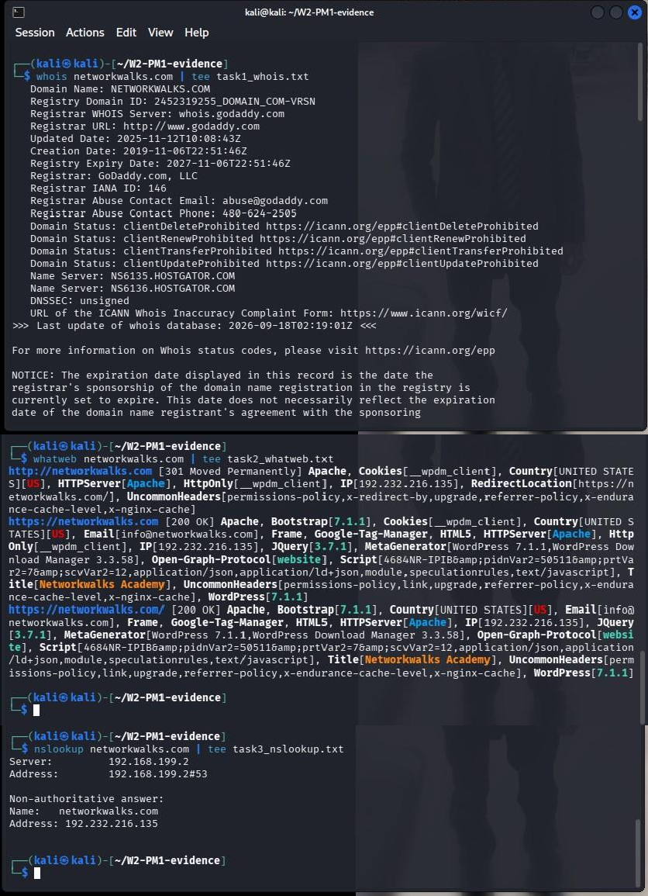

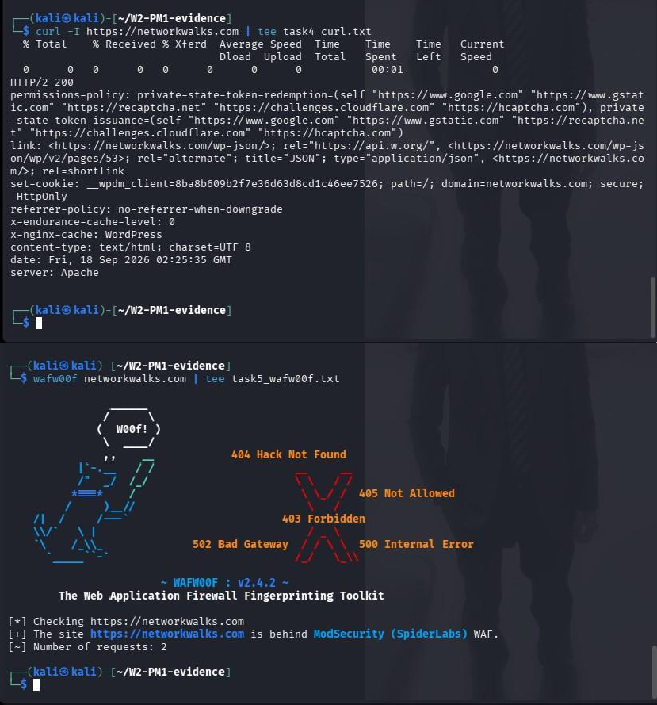

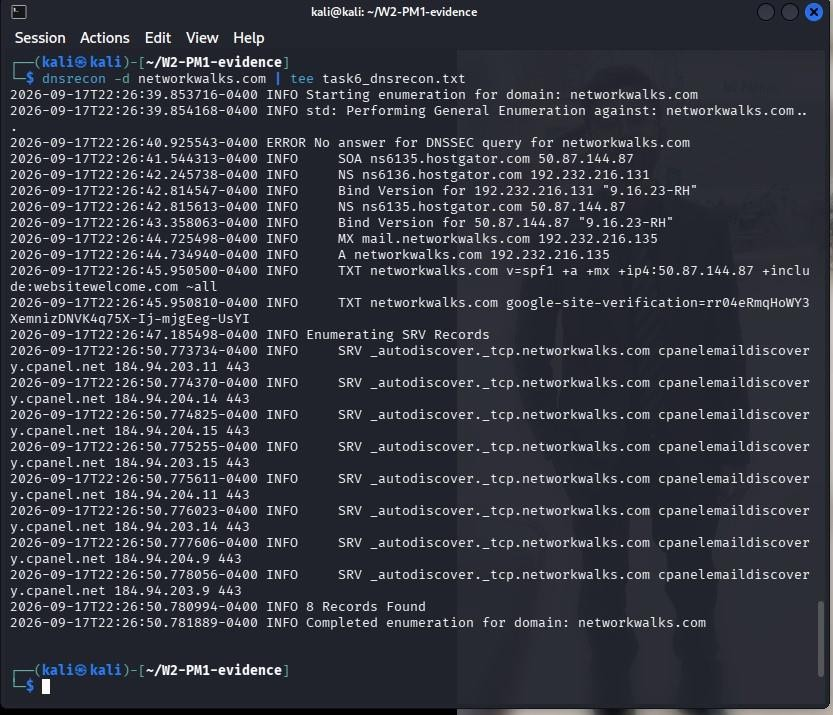

### W2-PM2 screenshots
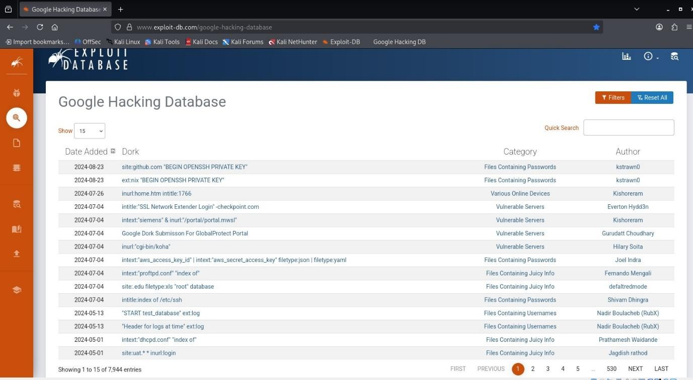

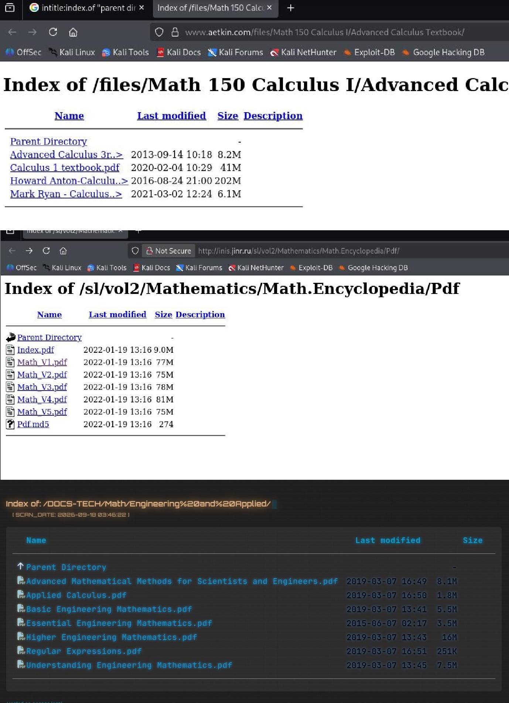

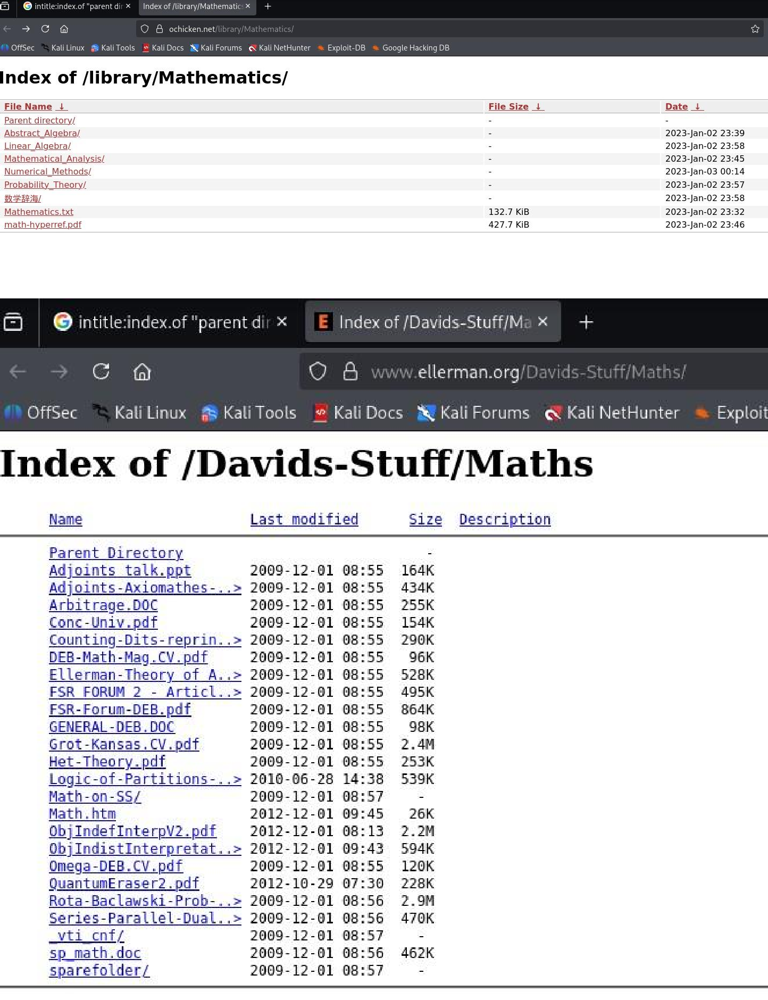

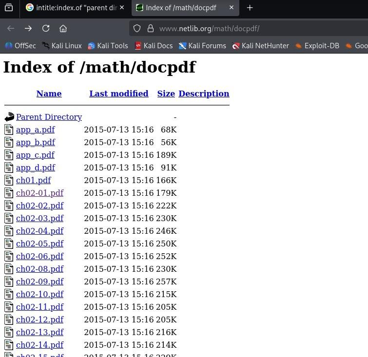

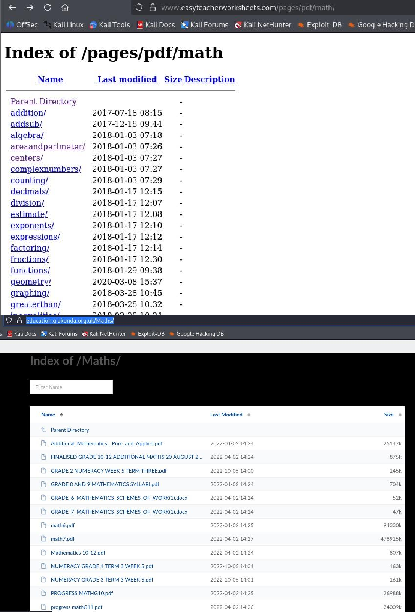

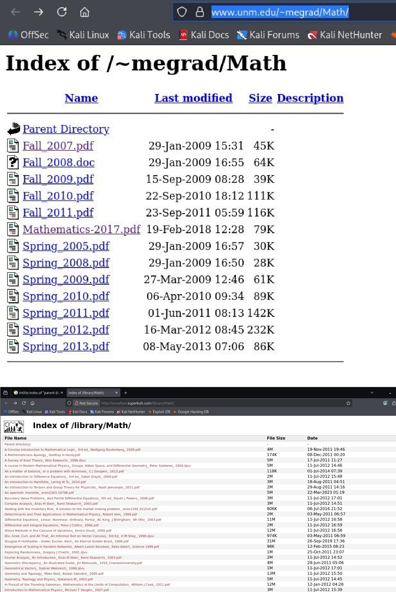

### W2-PM3 screenshots
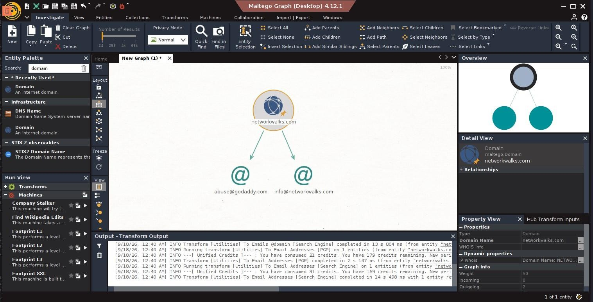

### W2-PM4 screenshots
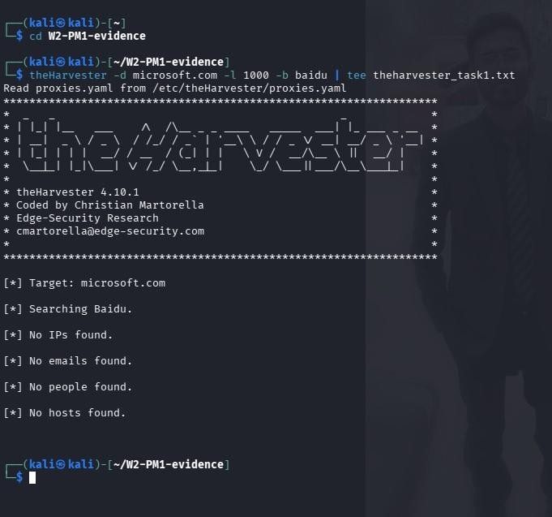

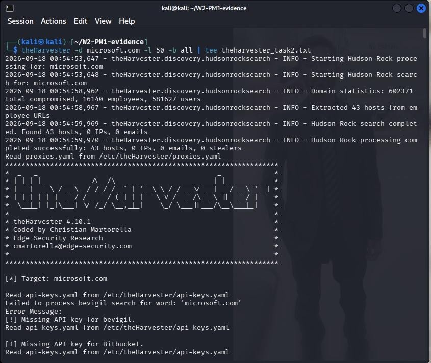

### W2-PM5 screenshots
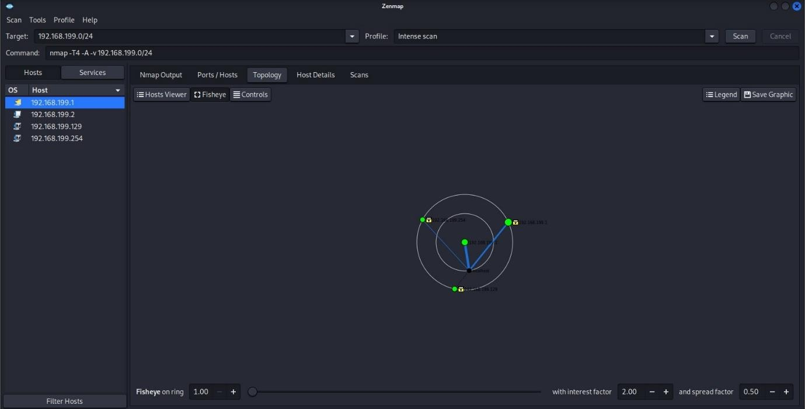

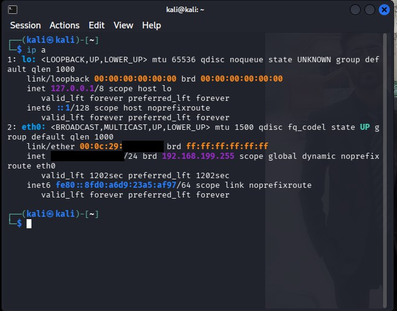

---

**Author**

Noman Atiq, NetworkWalks Academy (Batch B083)
